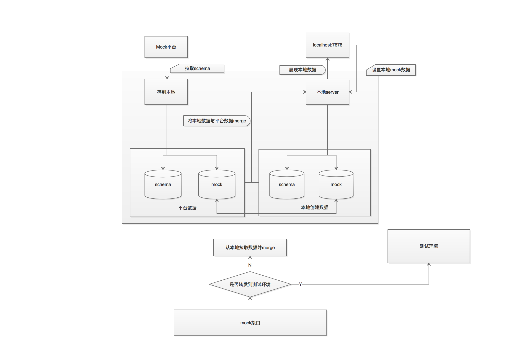

apim-client

### 使用示例
```npm run demo```

#### 配置项(使用方法请看example/demo.js)
```
{
	/* rd开发机地址，若配置，则转发到这台机器 */
	server: 'http://rdliantiao.laixin.otp.baidu.com', 
	
	/* mock平台相关参数配置 */
	host: 'http://cp01-rdqa-dev157-wuhuiyao.epc.baidu.com:8849',
	schemaUrl: '/api/getInterfaceSchemas',
	token: 'd79e5fa60c5ed6111b6a06a2f4fcbb6b',

	/* 是否自动打开本地自定义接口页面。页面地址为 http:127.0.0.1:7676 */
	autoOpenConfigPath: false,

	/*  每次启动是否清空上次缓存到本地的接口数据 */
	clearLocalData: true,

	/* rd开发机cookie */
	cookie: ''
}
```
#### 本机配置页
- 地址：[localhost:7676/index](http://localhost:7676/index)
- 页面使用：
   左侧为已配置mock接口list
   点击左侧list出现右侧mock展现具体mock内容，支持修改，编辑本地mock，平台拉取mock不可编辑

### 结构

